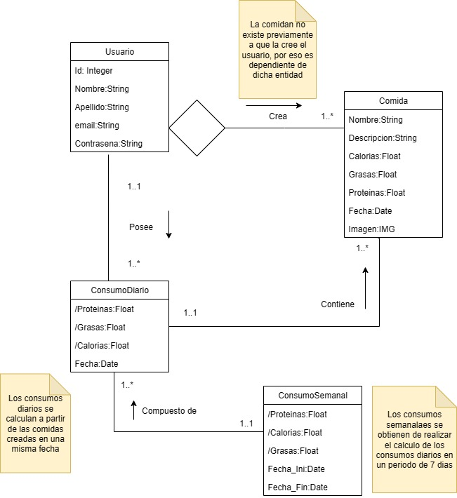
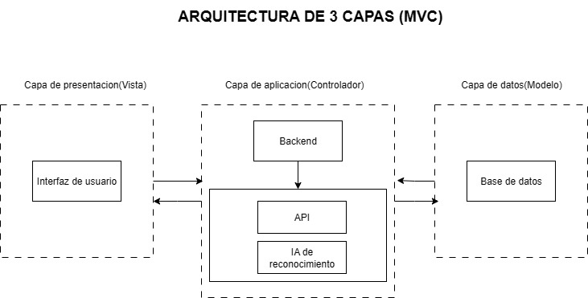

# TPI- MiPlato IA (Sistema Nutricional) - Grupo 16
Este es el archivo de documentación del Trabajo Práctico Integrador del Grupo 16 de la
materia Soporte a la Gestión de Datos con Programación Visual. Contiene la descripción
funcional, técnica y arquitectónica del sistema desarrollado.


## Descripción del proyecto

El sistema permite a los usuarios subir imágenes de sus comidas para que, mediante
reconocimiento automático de alimentos, se obtenga información nutricional detallada. Toda
la información obtenida se guarda en un historial por usuario y, al finalizar la semana, se
genera un reporte con estadísticas personalizadas del consumo alimenticio.

Objetivos: Automatizar el reconocimiento de comidas a partir de una imagen. Consultar los
valores calóricos y nutricionales usando una API externa. Almacenar las comidas en una
base de datos por usuario. Generar reportes semanales usando Pandas con métricas útiles
(promedios, rankings, porcentajes).

## Modelo de Dominio



## Bosquejo de Arquitectura



## Instalación

### Requisitos Previos
- Python 3.8 o superior instalado en el sistema.
- pip (gestor de paquetes de Python) instalado.
- MySQL instalado y en funcionamiento.

### Configuracion rapida

1. Clonar el repositorio:
   ```bash
   git clone https://github.com/maurojjzz/frro-python-TPI-2025-16.git
   ```

2. Navegar al directorio del proyecto:
   ```bash
   cd frro-python-TPI-2025-16
   ```  
3. Abrir la terminal y crear un entorno virtual (opcional pero recomendado):
   ```bash
   # crea el entorno virtual
   python -m venv .venv

   # activa el entorno virtual
   source .venv/bin/activate  # En Linux o Mac
   .venv\Scripts\activate  # En Windows
   ```

4. Instalar las dependencias:
   ```bash  
   pip install -r requirements.txt
   ```

5. Correr la aplicación:
   ```bash
   python app.py
   ```


## Requerimientos

Definir los requerimientos del sistema.

### Funcionales

- El sistema permite a los usuarios registrarse y autenticarse.
- Se puede subir una imagen de comida desde el navegador.
- La IA detecta y clasifica los alimentos en la imagen.
- Se consulta una API nutricional para obtener calorías y nutrientes.
- Se guarda el historial de comidas en la base de datos.
- Se genera un reporte semanal de consumo con estadísticas y gráficos.


### No Funcionales

Listado y descripción breve de los requerimientos no funcionales. Utilizar las categorias dadas:

### Portability

**Obligatorios**

- El sistema debe funcionar correctamente en múltiples navegadores (Sólo Web).
- El sistema debe ejecutarse desde un único archivo .py llamado app.py (Sólo Escritorio).

### Security

**Obligatorios**

- Todas las contraseñas deben guardarse con encriptado criptográfico (SHA o equivalente).
- Todas los Tokens / API Keys o similares no deben exponerse de manera pública.

### Maintainability

**Obligatorios**

- El sistema debe diseñarse con la arquitectura en 3 capas. (Ver [checklist_capas.md](checklist_capas.md))
- El sistema debe utilizar control de versiones mediante GIT.
- El sistema debe estar programado en Python 3.8 o superior.

### Reliability
- El sistema maneja errores HTTP (404, 500) y entradas inválidas del usuario.


### Scalability

**Obligatorios**

- El sistema debe funcionar desde una ventana normal y una de incógnito de manera independiente (Sólo Web).
    - Aclaración: No se debe guardar el usuario en una variable local, deben usarse Tokens, Cookies o similares.

### Performance

**Obligatorios**

- El sistema debe funcionar en un equipo hogareño estándar.

### Reusability
- Usa una base de datos SQL (MySQL) y ORM (SQLAlchemy).
- El sistema puede extenderse a nuevos modelos o APIs sin romper la arquitectura.


### Flexibility
- El sistema debe utilizar una base de datos SQL o NoSQL


**Obligatorios**

- El sistema debe utilizar una base de datos SQL o NoSQL

## Stack Tecnológico

### Capa de Datos
- **Base de Datos:** MySQL
- **ORM:** SQLAlchemy

### Capa de Negocio
  - **FatSecret API (Image Recognition v2)** - Permite reconocer automáticamente alimentos
desde una imagen y devuelve la información nutricional (calorías, proteínas, grasas, etc.),
adaptada por país e idioma.
  - **Gemini API** - Modelo de lenguaje avanzado de Google que permite comprender y generar texto de manera natural. Se utiliza para mejorar la interacción con el usuario y proporcionar respuestas contextuales.

- **Cloudinary** - Servicio de gestión de imágenes y videos en la nube que permite almacenar, transformar y servir contenido multimedia de manera eficiente.

### Librerias utilizadas:
- Flask
- SQLAlchemy
- requests
- pandas
- python-dotenv
- cloudinary
- matplotlib
- pymysql


### Capa de Presentación

- **Framework:** Flask
- **Interfaz Web:** El usuario puede autenticarse, subir imágenes y visualizar sus reportes nutricionales personalizados.